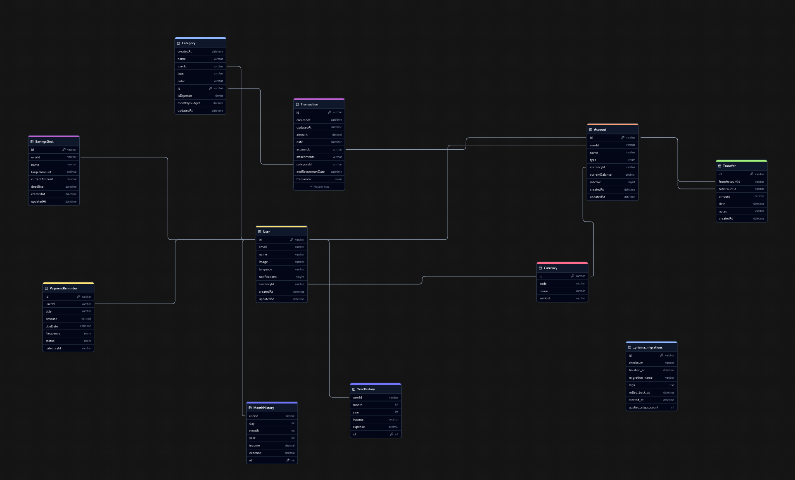

# Documentación Técnica - Sistema de Gestión Financiera

## Estructura de la Base de Datos



### Documentación de Base de Datos

### Enumeraciones

#### EstadoTransaccion

Estado actual de una transacción financiera:

- `COMPLETADA`: Transacción finalizada y confirmada
- `PENDIENTE`: Transacción en proceso o esperando confirmación
- `CANCELADA`: Transacción cancelada o revertida

#### TipoCategoria

Clasificación de movimientos financieros:

- `GASTO`: Salida de dinero (gastos, compras, pagos)
- `INGRESO`: Entrada de dinero (salario, ventas, etc.)

#### EstadoPago

Estado de los pagos programados:

- `PENDIENTE`: Pago aún no realizado dentro del plazo
- `PAGADO`: Pago completado satisfactoriamente
- `VENCIDO`: Pago no realizado y fuera de plazo
- `CANCELADO`: Pago cancelado o anulado

#### TipoCuenta

Tipos de cuentas financieras disponibles:

- `EFECTIVO`: Dinero físico
- `CUENTA_BANCO`: Cuenta corriente o de ahorro bancaria
- `TARJETA_CREDITO`: Tarjeta de crédito
- `AHORROS`: Cuenta específica para ahorros
- `INVERSION`: Cuenta para inversiones (acciones, fondos, etc.)

#### Frecuencia

Periodicidad de eventos repetitivos:

- `NINGUNA`: Sin recurrencia, evento único
- `DIARIA`: Se repite todos los días
- `SEMANAL`: Se repite cada semana
- `MENSUAL`: Se repite cada mes
- `ANUAL`: Se repite cada año

## Modelos Principales

#### User (Usuario)

Modelo central que gestiona toda la información personal y preferencias.

**Campos:**

- `id`: UUID único
- `email`: Email único para identificación
- `name`: Nombre del usuario (opcional)
- `image`: Avatar o foto de perfil (opcional)
- `language`: Idioma preferido (default: "es")
- `notifications`: Preferencia de notificaciones (default: true)
- `currencyId`: ID de la moneda base del usuario
- `createdAt`: Fecha de creación
- `updatedAt`: Última actualización

**Relaciones:**

- Tiene múltiples cuentas (Account[])
- Tiene múltiples categorías (Category[])
- Tiene múltiples metas de ahorro (SavingsGoal[])
- Tiene múltiples recordatorios (PaymentReminder[])
- Tiene una moneda base (Currency)
- Tiene historiales mensuales y anuales

#### Account (Cuenta)

Gestiona las diferentes cuentas financieras del usuario.

**Campos:**

- `id`: UUID único
- `userId`: ID del usuario propietario
- `name`: Nombre de la cuenta
- `type`: TipoCuenta
- `currencyId`: ID de la moneda
- `currentBalance`: Saldo actual (default: 0)
- `isActive`: Estado de la cuenta (default: true)
- `createdAt`: Fecha de creación
- `updatedAt`: Última actualización

**Restricciones:**

- Nombre único por usuario (`@@unique([userId, name])`)

**Relaciones:**

- Pertenece a un usuario (User)
- Tiene una moneda (Currency)
- Tiene múltiples transacciones (Transaction[])
- Tiene transferencias entrantes y salientes (Transfer[])

#### Transaction (Transacción)

Registra los movimientos financieros.

**Campos:**

- `id`: UUID único
- `accountId`: Cuenta asociada
- `categoryId`: Categoría de la transacción
- `amount`: Monto de la transacción
- `status`: EstadoTransaccion (default: COMPLETADA)
- `date`: Fecha de la transacción
- `notes`: Notas adicionales (opcional)
- `attachments`: URLs de comprobantes (opcional)
- `frequency`: FrecuenciaRecurrencia (opcional)
- `nextExecutionDate`: Próxima fecha de ejecución (opcional)
- `endRecurrencyDate`: Fecha fin de recurrencia (opcional)

#### Category (Categoría)

Sistema de clasificación para transacciones.

**Campos:**

- `id`: UUID único
- `name`: Nombre de la categoría
- `userId`: Usuario propietario
- `type`: TipoCategoria
- `icon`: Ícono representativo (opcional)
- `color`: Color para UI (opcional)
- `monthlyBudget`: Presupuesto mensual (opcional)

**Restricciones:**

- Combinación única de nombre, usuario y tipo (`@@unique([name, userId, type])`)

## Modelos de Seguimiento

#### SavingsGoal (Meta de Ahorro)

Gestiona objetivos de ahorro.

**Campos:**

- `id`: UUID único
- `userId`: Usuario propietario
- `name`: Nombre de la meta
- `targetAmount`: Monto objetivo
- `currentAmount`: Monto actual ahorrado (default: 0)
- `deadline`: Fecha límite (opcional)

#### PaymentReminder (Recordatorio de Pago)

Sistema de recordatorios para pagos.

**Campos:**

- `id`: UUID único
- `userId`: Usuario propietario
- `title`: Título del recordatorio
- `amount`: Monto a pagar
- `dueDate`: Fecha de vencimiento
- `frequency`: FrecuenciaRecurrencia (default: NINGUNA)
- `status`: EstadoPago (default: PENDIENTE)
- `categoryId`: Categoría asociada (opcional)

#### MonthHistory (Historial Mensual)

Registro mensual de movimientos financieros.

**Campos:**

- `id`: Autoincremental
- `userId`: Usuario propietario
- `day`: Día del mes
- `month`: Mes
- `year`: Año
- `income`: Total de ingresos
- `expense`: Total de gastos

#### YearHistory (Historial Anual)

Registro anual de movimientos financieros.

**Campos:**

- `id`: Autoincremental
- `month`: Mes
- `year`: Año
- `income`: Total de ingresos
- `expense`: Total de gastos
- `userId`: Usuario propietario

## Consideraciones Técnicas

#### Cascade Delete

- Las eliminaciones en cascada están configuradas para:
  - Usuario → Todas sus cuentas
  - Usuario → Todas sus categorías
  - Usuario → Todas sus metas de ahorro
  - Usuario → Todos sus recordatorios
  - Usuario → Todo su historial

#### Tipos de Datos

- Los montos monetarios utilizan el tipo `Decimal`
- Los historiales usan `Decimal(15,2)` para mayor precisión
- Las fechas utilizan el tipo `DateTime`
- Los IDs utilizan UUIDs excepto en historiales

#### Índices y Rendimiento

- Índices únicos en email de usuario
- Índices únicos compuestos en nombres de cuenta por usuario
- Índices únicos en categorías por nombre, usuario y tipo

#### Relaciones

- Todas las relaciones están debidamente indexadas
- Las relaciones críticas tienen eliminación en cascada
- Las transferencias mantienen referencias bidireccionales

## Scripts del Proyecto

### Desarrollo

```bash
# Servidor de desarrollo
npm run dev          # Inicia Next.js con Turbopack
npm run build        # Versión de producción
npm run start        # Servidor de producción
npm run type-check   # Verifica tipos TypeScript

# Calidad de código
npm run lint         # ESLint
npm run format       # Prettier
npm run lint:fix     # Auto-corrección
npm run prepare      # Hooks de Husky
```

### Comandos Prisma

```bash
# Migraciones
npm run prisma:migrate <nombre>  # Nueva migración
npm run prisma:deploy           # Aplicar en producción
npm run prisma:push            # Actualizar sin migración

# Desarrollo
npm run prisma:studio          # UI de base de datos
npm run prisma:seed           # Datos de prueba
npm run prisma:setup          # Setup completo

# Reset
npm run prisma:wipe           # Reset completo
npm run prisma:reset-dev      # Reset con seeds
```

## API Endpoints

### Autenticación y Usuario

```
POST /auth/register            # Registro
POST /auth/login              # Login
GET  /users/me                # Perfil actual
PUT  /users/me                # Actualizar perfil
PUT  /users/preferences       # Preferencias
```

### Gestión Financiera

```
# Cuentas
GET    /accounts              # Listar cuentas
POST   /accounts              # Nueva cuenta
GET    /accounts/{id}         # Detalles
PUT    /accounts/{id}         # Actualizar
DELETE /accounts/{id}         # Desactivar

# Categorías
GET    /categories           # Listar todas
GET    /categories/expenses  # Solo gastos
GET    /categories/income    # Solo ingresos
POST   /categories          # Nueva categoría
PUT    /categories/{id}     # Actualizar
DELETE /categories/{id}     # Eliminar

# Transacciones
GET    /transactions        # Listar (con filtros)
POST   /transactions       # Nueva transacción
PUT    /transactions/{id}  # Actualizar
DELETE /transactions/{id}  # Eliminar
GET    /transactions/recurring # Recurrentes
```

### Funcionalidades Especiales

```
# Transferencias
GET    /transfers          # Listar
POST   /transfers         # Nueva transferencia

# Metas de Ahorro
GET    /savings-goals     # Listar metas
PUT    /savings-goals/{id}/progress # Actualizar progreso

# Recordatorios
GET    /payment-reminders # Listar
PUT    /payment-reminders/{id}/status # Actualizar estado

# Estadísticas
GET    /statistics/monthly    # Resumen mensual
GET    /statistics/yearly     # Resumen anual
GET    /statistics/categories # Por categoría
GET    /statistics/trends     # Tendencias
```

## Consideraciones Técnicas

### Seguridad

- Autenticación requerida para todos los endpoints (excepto auth)
- Validación de pertenencia de recursos al usuario
- Sanitización de inputs

### Performance

- Paginación en listados
- Caché de datos frecuentes
- Optimización de queries

### Validaciones

- Montos positivos en transacciones
- Fechas válidas en recordatorios
- Unicidad de nombres en categorías por usuario

```

```
